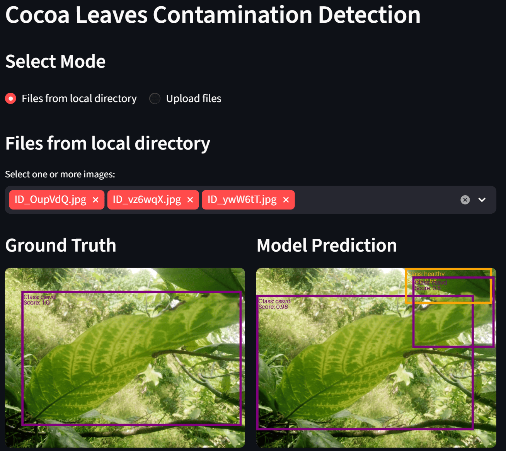

# Problem Introduction

The dataset for this project is sourced from Kaggle: [Amini Cocoa Contamination Dataset](https://www.kaggle.com/datasets/ohagwucollinspatrick/amini-cocoa-contamination-dataset).

The objective is to develop an object detection model that can accurately identify diseased cocoa leaves from images. This aims to reduce the workload of cocoa farmers, as current practices rely on manual visual inspection by agricultural officers.

# Exploratory Data Analysis (EDA)

The dataset contains both training and test splits. Only the training set is used, as the test set does not include bounding box ground truth annotations.

**Data Cleaning**
- Removed rows with inconsistent labeling (~19 out of 10,000 rows).
- Clipped bounding boxes that exceeded image dimensions.

**Data Properties**
- Three classes with slight imbalance: Healthy (44%), Anthracnose (23%), CSSVD (33%).
- Over 80% of images contain 1–2 objects; the maximum is 13 objects per image.
- Most images contain a single class; only 6 images contain multiple classes.
- Not all leaves in each image are annotated—typically only larger leaves are labeled.
- Images vary in orientation and brightness, reducing the need for additional data augmentation.

# Solution Overview
This project outlines the full pipeline from model development to deployment. Although only one model was trained, the codebase is designed to support multiple PyTorch-based object detection models with minimal changes to training and inference scripts.

**1) Model Construction**

A PyTorch object detection model is defined with a custom forward method and registered using a decorator-based model registry. This enables flexible model selection in training, as long as the models inherit from torch.nn.Module and follow a standardized output format.

**2) Processor**

Each model needs a corresponding processor to handle preprocessing, since different models require different input images and bounding boxes formats for training. Image preprocessing includes resizing or letterboxing, for which bounding boxes are required to be scaled accordingly. Optional normalization may be applied to bounding boxes.

**3) Dataset Splitting**

The dataset is split into training, validation, and test sets using multi-label stratified sampling to preserve class distribution in all datasets due to slight class imbalance. Splitting is performed at the image level to avoid data leakage, since multiple objects and classes can appear in a single image.

**4) Hyperparameter Tuning**

Optuna is used to optimize hyperparameters from the provided hyperparameter search space, maximizing mAP@0.5 (Mean Average Precision at 0.5 IoU). Early stopping is applied based on validation loss. K-fold cross-validation was not used due to training cost (~10 minutes per epoch). All  train and validation loss and metrics as well as hyperparameters are recorded using MLflow.

**5) Model Training**

The final model is trained on the combined training and validation sets using the best hyperparameters. Evaluation is performed on the test set. Model artifacts and evaluation metrics are stored in the MLflow registry for future use.

**6) Inference Processor**

Each trained model requires a corresponding inference processor that includes:
- A preprocessing step to prepare input images.
- A postprocessing step to map predicted bounding boxes back to original image dimensions.

Inference processors are registered using a decorator-based registry for easy integration.

**7) Inference Pipeline**

Frontend: Streamlit for image submission and visualization of annotated images of leaves identified and classified.
- Local data mode: includes model prediction with ground truth comparison.
- Upload images mode: supports inference on images without provided annotations.

Backend: FastAPI service that downloads the trained models from MLflow, applies preprocessing and postprocessing using corresponding inference processor and returns annotated images of model's prediction.

**Docker Containers**
1) MLflow server
2) Training container (model training pipeline)
3) FastAPI backend (inference service)
4) Streamlit frontend (user interface)

# Usage
Scripts can be run on local machine or using Docker container. All commands for setup and subsequent steps are from root directory.

## Environment Setup
For local machine, ensure `pyproject.toml` and `uv.lock` are present before running the command to get the virtual environment and activate it:
```bash
uv sync --frozen
source .venv/bin/activate
```

## MLflow Setup
Ensure MLflow server is running before running training script or inference.

**1) Local Machine**

Create the directories to store the data of MLflow and start the server.
```bash
mkdir -p /mlflow/db mkdir -p /mlflow/artifacts

mlflow server
    --host 0.0.0.0
    --port 5000
    --backend-store-uri sqlite:////mlflow/db/mlflow.db
    --artifacts-destination /mlflow/artifacts
    --serve-artifacts
```

**2) Docker**

Create the directories locally to ensure data persistence for MLflow server and start the container.

```bash
mkdir -p /mlflow-data/db mkdir -p /mlflow-data/artifacts
docker compose up -d mlflow
```

Verify the MLflow server is up: http://localhost:5000/

## Model Training
The configuration file `src/config/train_config.yaml` contains all training parameters. Edit that file as needed, or override individual parameters from the command line, since the configuration is loaded using Hydra.

Specify the image directory path and bounding box CSV file path under `data`. Add the import paths for any new models or processors under `model_plugins` and `processor_plugins` so they can be loaded correctly.

Set `mode` to either "hyperparameter_tune" or "train_full_set". For hyperparameter tuning, edit the search space under `hyperparameters`; for full training, edit the values under `best_params`.

### Running Training Script
You can override any of the configuration variables from the command line when needed. For example, `model_name` should match one of the model names registered in the training registry.

**Docker**
```bash
docker compose run --name <container-name> -d pipeline uv run python main.py mode=<training-mode> [<config_key>=<value>]
```

**Local Machine**
```bash
python main.py mode=<training-mode> mlflow.uri="http://localhost:5000" [<config_key>=<value>]
```

### Monitoring and Troubleshooting
Monitor the training process through Docker container logs or through log files in the root `/logs` directory. Also verify that training metrics and run information are being recorded in MLflow.

The training script uses automatic mixed precision on CUDA to reduce memory usage and also performs routine cleanup, such as deleting large tensors, calling `gc.collect()`, and using `torch.cuda.empty_cache()`. Even with these safeguards, OOM and runtime errors can still occur, especially when training larger models. To run the training script after encountering these errors:
- Reduce the number of DataLoader workers in `train.py`.
- Reduce the batch size.
- Reduce the size of the validation set, since evaluation metrics may retain tensors in memory before computation.
- If using Docker, increase the shared memory size (`shm_size`) and memory limit (`mem_limit` and `memswap_limit`) for the pipeline container.

## Inference
The configuration file `src/config/inference_config.yaml` contains all inference settings. Edit this file to match the inference setup.

Specify the image directory path in `data_dir` and the bounding box CSV file in `df_file` in order to visualize predictions against ground truth annotations. In the MLflow Model Registry, assign an alias to the model version you want to use, then set the model artifact URI with the format `models:/<model-name>@<alias>`.

Add the import paths for any inference processors under `inference_processor_plugins` so they can be loaded correctly. Then set `inference_processor_name` to the name registered for the inference processor used by the selected model.

Edit `class_map`, which defines the mapping from label index to class name, to match the selected inference model. This is necessary because models reserve a default label index for the background class. Class names should be sorted in alphabetical order.

### Inference Model Deployment
**Local machine**

Update the URL from docker container names to localhost in the `src/config/inference_config.yaml`, by seting `mlflow_uri: "http://localhost:5000"` and `inference_url: "http://localhost:8000/infer"`.

Update the virtual environment to include libraries for inference.

```bash
uv sync --group inference
```

Start up the backend FastAPI first since frontend Streamlit depends on it.
```bash
uvicorn src.inference.fastapi_inference:app --host 0.0.0.0 --port 8000
```

Start the Streamlit frontend.
```bash
streamlit run src/inference/streamlit_app.py
```

**Docker**
```bash
docker compose up -d streamlit fastapi
```

**Use inference model**
- Verify FastAPI server is healthy: http://localhost:8000/health
- Access the Streamlit interface to use the inference model: http://localhost:8501

### Inference Troubleshooting
The inference pipeline processes images in batches and performs cleanup after each batch to reduce the risk of OOM and runtime errors. However, errors may still occur when processing very large images. To run the inference after encountering the errors:
- Reduce the inference batch size (`inference_batch_size`) in the configuration file.
- Reduce the number of input images processed in a single run.

# Implemented Model
The model implemented is a CNN-based object detector: **Faster R-CNN with a Feature Pyramid Network (FPN), using a frozen pre-trained ConvNeXtV2 backbone** (convnextv2_base.fcmae_ft_in22k_in1k).

Faster R-CNN is a well-established and effective object detection framework, while FPN enhances performance by providing multi-scale feature maps, which capture richer information compared to single-scale representations. The ConvNeXtV2 backbone is selected due to its strong performance as a feature extractor.

Vision Transformer-based models were not used, as they typically require larger datasets and higher memory consumption.

The model was trained with the following dataset split: Training: 48%, Validation: 12% (20% of the combined train + validation set) and Test: 40%. This results in approximately 600 samples per class in the training set used for hyperparameter tuning, which is sufficient given the moderate complexity of the dataset.


Hyperparameter tuning took approximately 2 hours per trial, using up to 8 GB of CPU memory. The best hyperparameters found are:
| Hyperparameter | value |
| -------- | -------- |
| Learning rate | 9.31e-05 |
| Weight decay | 4.38e-05 |
| Batch size | 2 |


Full training on the combined training and validation set took approximately 2.5 hours over 12 epochs, using 8 GB of VRAM. Evaluation on the test set produced the following results:

| Metric | value |
| -------- | -------- |
| mAP@0.5 | 0.69 |
| mAP@0.5:0.95 | .38 |


A mAP@0.5 score of 0.69 indicates acceptable object detection performance. However, the lower mAP@0.5:0.95 (Means Average mAP over IoU thresholds, from 0.5 to 0.95 with step 0.05) score of 0.38 suggests that the model struggles with precise bounding box localization.


## Model Performance
- The model generates more bounding boxes than the ground truth annotations, even after filtering predictions with confidence scores above 0.5. This occurs because the dataset labels only prominent leaves, while the model detects additional smaller leaves.

- Predicted bounding boxes sometimes exhibit significant overlap, likely due to the default Non-Maximum Suppression (NMS) threshold being insufficiently strict. This can be addressed by applying stricter NMS post-processing to the model outputs.

- Manual inspection of randomly sampled images shows good class prediction accuracy, with bounding box localization being the primary source of error.

## Limitations
**1) Confidence Threshold Tuning**

The fixed 0.5 confidence threshold may not be the most suitable threshold to use to filter out bounding boxes to prevent cluterring. There is a need to experiment with different thresholds to ensure that most diseased leaves are identified since misses will lead to bad crops.

**2) Multi-Class Performance**

Model performance on images with multiple classes cannot be reliably assessed, as only 6 images contain multiple classes—insufficient for meaningful evaluation.



## Further exploration
**1) Training Data Selection**

Only 48% of available data was used for training due to compute constraints during hyperparameter tuning. While class distribution was preserved through stratified sampling, the selection for the training set was random. A better approach would be to curate a more challenging training subset by prioritizing:
- Images with low luminosity or unusual orientations
- Dense scenes with overlapping leaves
- Images containing many annotated objects

This would better prepare the model for real-world deployment conditions.

**2) Loss Function**

The default L1 loss was used for bounding box regression. CIoU (Complete Intersection over Union) loss could be more appropriate, as it directly optimizes IoU while accounting for geometric properties of the bounding boxes (center distance, aspect ratio, overlap). This should lead to more precise bounding box predictions.

**3) Alternative Model Architecture**

Only a single CNN-based model (Faster R-CNN + ConvNeXtV2) was evaluated. Further experiments can be done on Vision Transformer models or other backend encoders.
